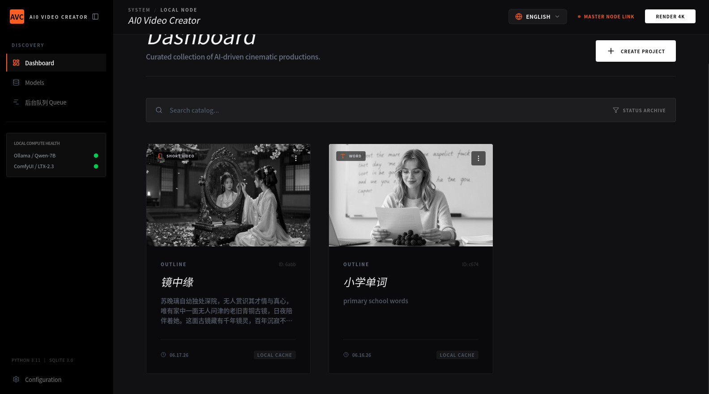
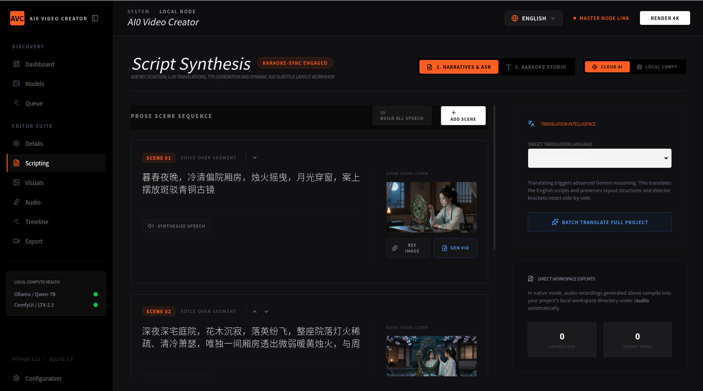
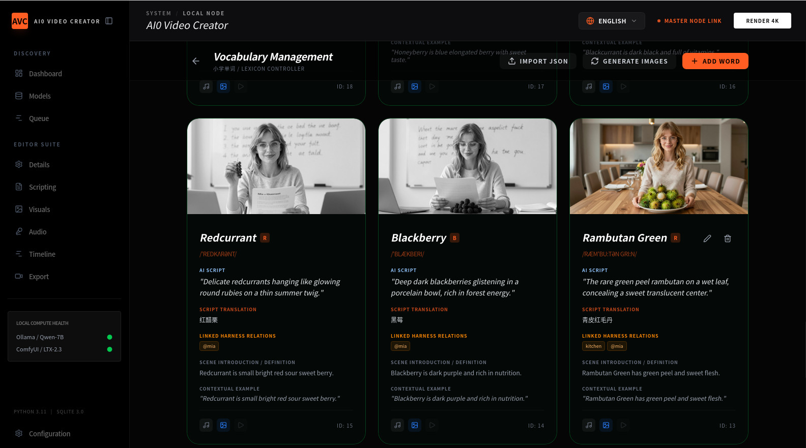
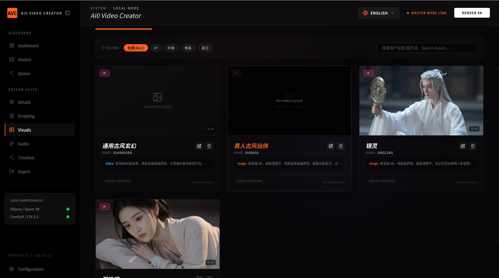

# ai0-video-creator (AI Video Studio)
<p align="center">
  
</p>

<p align="center">
  
  
  
  
  
  <br/>
  
  
  
</p>

<p align="center">
  <strong>An industrial-grade desktop workspace built for the next generation of AI content creators and developers.</strong>
</p>

<p align="center">
  <a href="./README.md#english">English</a> | <a href="./README.md#简体中文">简体中文</a>
</p>

<a name="english"></a>
# ai0-video-creator — AI Video Studio
`ai0-video-creator` is a premium, full-featured desktop audio-visual content creation suite designed to streamline the pipeline from writing scripts to generating high-fidelity video assets. Powered by **Tauri v2**, **Rust**, **React 19**, **Tailwind CSS v4**, and **SQLite**, the studio bridges localized desktop execution and automated cloud-hosted AI integrations seamlessly.

Whether you are crafting short vertical reels, horizontal narrative stories, multi-actor conversations, vocabulary educational cards, or running frame-accurate lip-sync video translations, `ai0-video-creator` handles the orchestration via native APIs, Ollama, and customizable ComfyUI backends.

## 📸 Studio Screenshots
<table align="center" width="100%">
  <tr>
    <td width="50%" align="center">
      <br>
      <sub><b>Project Hub Workspace</b></sub>
    </td>
    <td width="50%" align="center">
      <br>
      <sub><b>AI Script Editor & Storyboarding</b></sub>
    </td>
  </tr>
  <tr>
    <td width="50%" align="center">
      <br>
      <sub><b>Bilingual Vocabulary & Flashcard Studio</b></sub>
    </td>
    <td width="50%" align="center">
      <br>
      <sub><b>AI Strategy & Quality Audit Harness</b></sub>
    </td>
  </tr>
</table>

## 🚀 Key Scenes & Modes
The workbench features **five custom creation modes** (Scene Types) to suit different creative content pipelines:
### 🎬 1. Short Video Creator (`short_video`)
* Optimized for **9:16 vertical short-form video releases** (15 to 60 seconds).
* Dynamic video frame composition, text-to-image script blueprints, and narrative pacing controls.
### 📖 2. Story Notebook (`story`)
* Centered on **16:9 horizontal narrative** story-driven structures.
* Staggered sequence layout, custom illustration boards, and multi-segment timeline assembly.
### 👥 3. Multi-Actor Dialogue Engine (`dialogue`)
* Focuses on multi-character conversational scripts.
* Configurable character casting, custom face avatar allocations, and distinctive voice-cloning configurations.
### 🎓 4. Bilingual Word & Flashcard Generator (`word`)
* An educational asset design editor designed for modern language learning.
* Standard search and alphabetical index keys (A-Z list controls) to browse vocabularies.
* Automated IPA symbols generation, Chinese/English definitions sync, script builders, and LTX2.3/Qwen video generator prompt adapters.
### 🌍 5. Video Translation & LipSync Workbench (`video_translation`)
* A flagship video localization and dubbing terminal.
* High-integrity automated subtitle extraction and edit timelines.
* Automated text translation powered by the unified `@google/genai` (Gemini-1.5/2.0/3.5) SDK.
* Multi-actor voice cloning utilizing **Volcengine Voice Clone App** and **Qwen3-TTS**.
* Dynamic audio-visual lip synchronization with support for **LTX2.3 Spatial Video LipSync Pipeline** and **Wav2Lip**.

## 🛠️ Advanced Tech Stack
`ai0-video-creator` is built with a decoupled, environment-aware architecture, enabling it to run natively on the desktop or fall back gracefully to a standard responsive browser container:
* **Frontend Engine**: React 19, TypeScript 5.8, React Router v7, Recharts / D3.
* **Aesthetics & Micro-interactions**: Tailwind CSS v4.0 (fully compiled at build-time using `@tailwindcss/vite` plugin), Framer Motion / Motion v12, and Lucide React.
* **Native Desktop Container**: Tauri v2, Rust Cargo Shell.
* **Durable Local Database**: Embedded **SQLite** (`main.db` via Tauri SQL plugin) governed by a robust 11-step database migration lifecycle (with client-side LocalStorage fallback).
* **AI Orchestration Framework**:
  * **Gemini Client-Side Proxy**: Native, unified `@google/genai` SDK for lightning-fast translation & prompt compile.
  * **Ollama Connection**: Dedicated port mapping for offline LLM narration writing.
  * **ComfyUI Bridge**: Direct WS/API pipeline integrations targeting `z-image-turbo` and `qwen-image-2512` model nodes.

## ⚙️ Desktop-Grade Settings
* **Workspace Synchronization**: Configurable save directories mapped directly onto the native OS filesystem via `tauri-plugin-fs`.
* **Path Selector Dialogue**: Elegant directory-dialog query controls (utilizing `tauri-plugin-dialog`) to select python executables dynamically.
* **System Hardening**: Set customizable CUDA core devices (e.g., `cuda:0`) and thread bounds manually to maximize hardware potential during local ComfyUI rendering cycles.

## 🔌 ComfyUI Integration Guide
This application features a **Universal ComfyUI Workflow Adapter** that binds fields in your projects (such as script sentences, audio references, and images) directly to any third-party ComfyUI API-format workflow.
### 1. How to Export API-Format Workflow from ComfyUI
To import a workflow into the application, you must export it in the **API/Developer JSON format**:
1. Open your ComfyUI in the browser.
2. Click the **Gear (Settings)** icon in the upper right menu panel.
3. Check the checkbox for **"Enable Dev mode"**. Close settings.
4. On the main menu panel, you will now see a new button: **"Save (API Format)"**.
5. Click **"Save (API Format)"** to export your workflow as a raw pipeline `.json` file. (Do *not* use the regular "Save" button, as it includes client layout data that the backend cannot execute directly).
### 2. How to Import the Workflow into the App
1. Navigate to the sidebar or corresponding configuration page (e.g. **ComfyUI / LTX-2.3**).
2. Click the **"Import Workflow"** or **"Upload JSON"** button next to your target task model (e.g. Image Turbo, LTX Video, Qwen3-TTS).
3. Select your exported `.json` or `.txt` workflow file. The system will automatically parse and cache it securely.
### 3. Node Naming Conventions (Title Mapping Protocol)
To allow the workstation to dynamically inject project fields, you should rename specific nodes in ComfyUI by right-clicking them and selecting **"Title"**:
* **Inputs**:
  * **Text / Prompts**: Rename target CLIP Text Encode nodes to include `Prompt` (e.g., `CLIP Text (Prompt)`).
  * **Images**: Rename LoadImage nodes to include `Load Image` or `Input Image`.
  * **Videos**: Rename LoadVideo/VHS nodes to include `Load Video` or `Input Video`.
  * **Audios**: Rename LoadAudio/VHS nodes to include `Load Audio` or `Input Audio`.
* **Outputs**:
  * **Images**: Ensure output nodes are named `Save Image` or contain `Output Image` / `PreviewImage`.
  * **Videos**: Ensure the video compiler node is named `Video Combine` or `Save Video`.
  * **Audios**: Ensure the audio compiler node is named `Save Audio` or `Output Audio`.

For detailed specifications, see [COMFYUI_UNIVERSAL_ADAPTER.md](./COMFYUI_UNIVERSAL_ADAPTER.md).

## ⚡ Quick Start
### Prerequisites
* Node.js (v18+ recommended)
* Rust & Cargo (for Tauri desktop builds)
```bash
# Install all dependencies
npm install

# Run web preview
npm run dev

# Launch native Tauri desktop app
npm run tauri dev

# Build production desktop installer
npm run tauri build
```

## 👥 Community & Communication Groups
### 1. WeChat Group
Scan the QR code below to join the WeChat communication group:
<p align="center">

</p>

### 2. QQ Group
Group Number: `1098732423`

### 3. WhatsApp Group
Group Link: https://chat.whatsapp.com/Gnl652vNQGL0QwpmoH89Fc
> Note: This link is an overseas website, access may be restricted in some regions.

## 📄 License
Under the Business Source License 1.1. Commercial usage requires a separate commercial license from the author; custom integrations may specify additional separate terms.

---

<a name="简体中文"></a>
# ai0-video-creator 人工智能视频创作工作台
## 项目介绍
ai0-video-creator 是面向新一代AI内容创作者与开发者打造的工业级桌面影音创作工具。基于 Tauri v2 + Rust + React 19 构建，打通脚本撰写到高清视频生成全链路，支持本地离线运行、Ollama大模型、自定义ComfyUI AI工作流，同时兼容云端Gemini翻译、火山引擎语音克隆、LTX/Wav2Lip唇形同步等能力。

## 📸 软件界面截图
<table align="center" width="100%">
  <tr>
    <td width="50%" align="center">
      <br>
      <sub><b>项目总览工作台</b></sub>
    </td>
    <td width="50%" align="center">
      <br>
      <sub><b>AI脚本分镜编辑器</b></sub>
    </td>
  </tr>
  <tr>
    <td width="50%" align="center">
      <br>
      <sub><b>双语单词闪卡生成器</b></sub>
    </td>
    <td width="50%" align="center">
      <br>
      <sub><b>AI质量管控面板</b></sub>
    </td>
  </tr>
</table>

## 🚀 五大创作模式
### 🎬 1. 短视频生成器 short_video
适配9:16竖屏短视频（15-60秒），支持动态画面排版、文案转分镜、叙事节奏自定义。
### 📖 2. 故事长片编辑器 story
面向16:9横版剧情视频，分段式时间线、自定义插画分镜、多片段拼接。
### 👥 3. 多角色对话引擎 dialogue
支持多人物对话脚本，自定义虚拟形象、音色克隆，批量生成对话类视频。
### 🎓 4. 双语词卡生成 word
语言学习专用工具，自动生成IPA音标、中英释义，配套视频生成提示词模板。
### 🌍 5. 视频翻译唇形同步 video_translation（旗舰功能）
自动提取字幕、多语言AI翻译、多角色克隆配音，支持LTX2.3空间视频唇形同步、Wav2Lip高精度对口型。

## 🛠️ 技术栈
- 前端：React 19、TypeScript 5.8、Tailwind CSS v4、Framer Motion
- 桌面端容器：Tauri v2 + Rust
- 本地数据库：SQLite
- AI调度：Gemini、Ollama、ComfyUI、火山语音克隆、Qwen3-TTS

## ⚙️ 本地硬件优化设置
- 自定义工作目录，直接映射系统本地文件
- 可视化路径选择器，快速配置Python运行环境
- 自定义CUDA设备、渲染线程数，充分释放显卡算力

## 🔌 ComfyUI 工作流接入教程
1. ComfyUI开启开发者模式，导出API格式JSON工作流（请勿使用普通保存）
2. 在软件配置页上传JSON文件，系统自动解析缓存
3. 修改节点标题名称，实现文案、图片、音频自动注入工作流
详细规范参考文档：[COMFYUI_UNIVERSAL_ADAPTER.md](./COMFYUI_UNIVERSAL_ADAPTER.md)

## ⚡ 快速本地启动
### 环境要求
- Node.js 18 及以上
- Rust & Cargo（编译桌面客户端必备）
```bash
# 安装依赖
npm install

# 网页预览调试
npm run dev

# 启动完整桌面客户端（推荐）
npm run tauri dev

# 打包正式安装程序
npm run tauri build
```

## 👥 交流社群
### 1. 微信交流群
扫码添加微信群：
<p align="center">

</p>

### 2. QQ群
群号：`1098732423`

### 3. WhatsApp海外交流群
群链接：https://chat.whatsapp.com/Gnl652vNQGL0QwpmoH89Fc
> 提示：该链接为境外网页，部分网络环境下可能无法访问。

## 📄 许可证说明
项目采用 BSL 1.1 商业源码许可协议。个人非商用可免费使用；企业商用、二次分发需单独向作者申请商业授权，定制化集成可能附加额外条款。