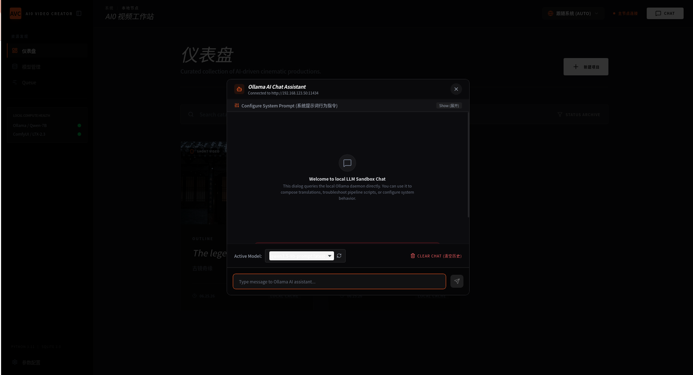
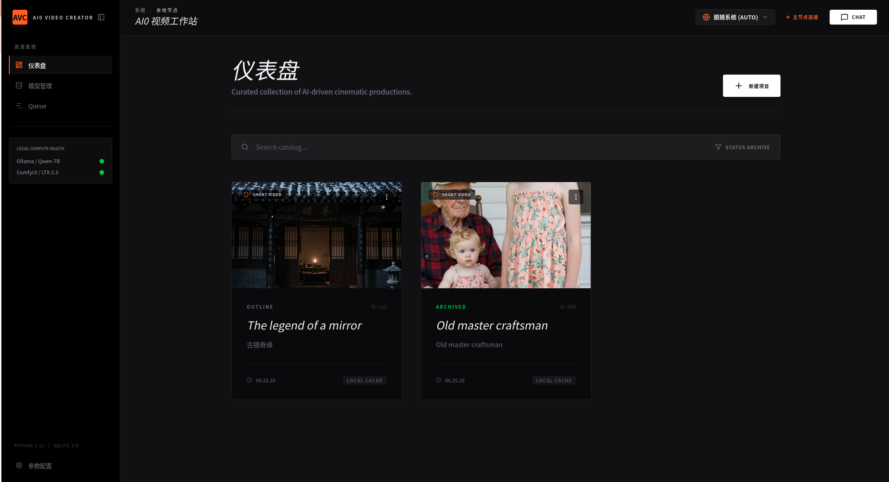
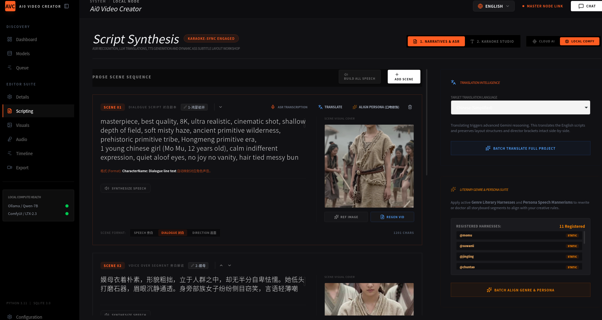
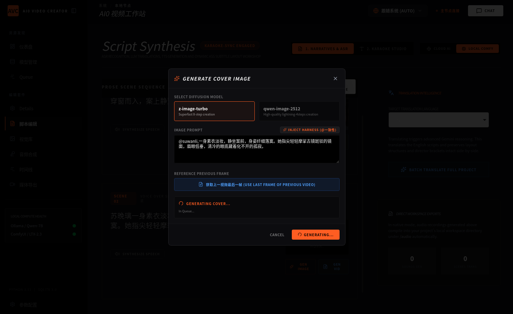
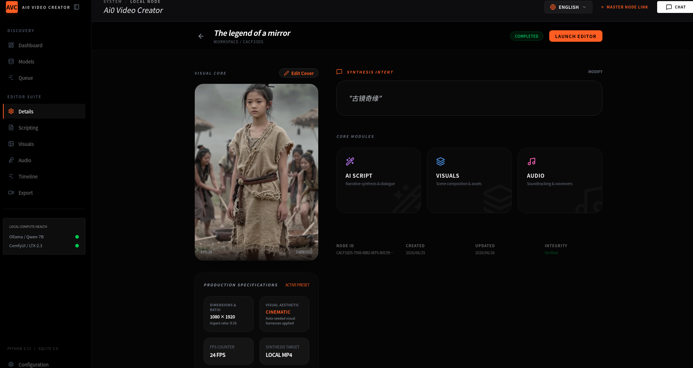
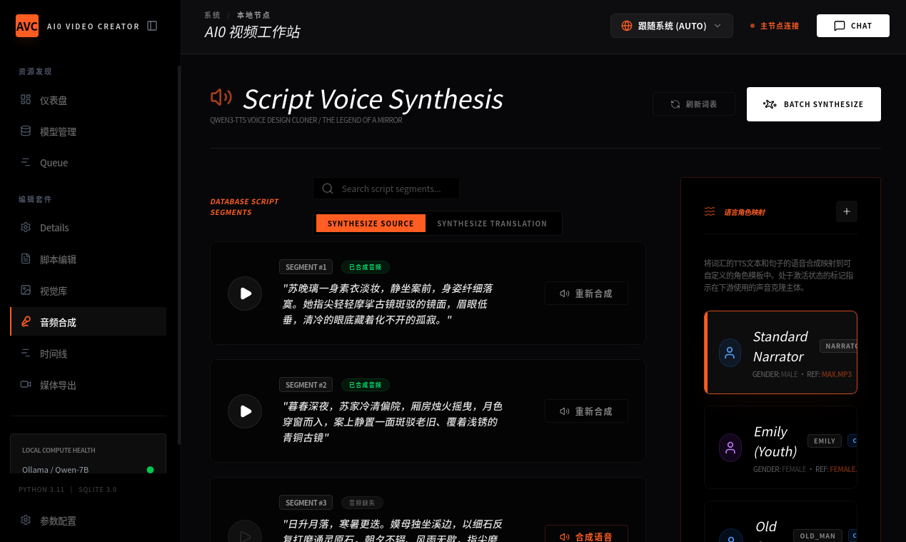
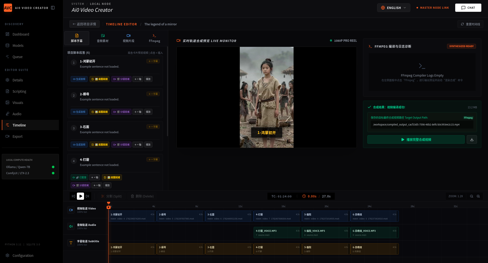
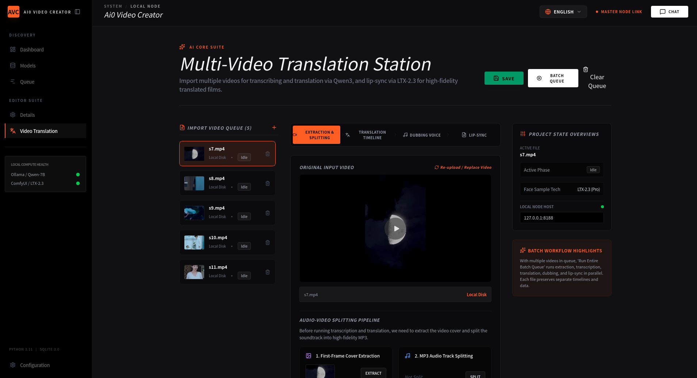

# Ai0 Video Creator
全功能 Tauri v2 桌面AI视频创作套件，同时支持**本地ComfyUI离线工作流**与云端API双后端。
可一站式制作短剧、AI翻译配音影片、单词教学短片、剧情对话片段、原创叙事故事。

语言切换：[English Readme](./README.md)

## 软件界面截图
### 仪表盘与内置Ollama本地对话助手


### 项目仪表盘素材总库


### IP角色视觉资产素材库
永久存储统一IP人物、场景环境、场景道具，上传参考图锁定五官特征，彻底解决多镜头人物形象闪烁。


### 剧本综合编辑面板
撰写场景对白、旁白叙事与电影级渲染提示词，内置本地Ollama Qwen大模型完成双语翻译、人物口吻人设定制，一键绑定注册好的IP素材提交ComfyUI渲染任务。


### 项目封面生成弹窗
本地使用 z-image-turbo / qwen-image-2512 扩散模型生成项目封面，可复用上一镜头末帧保证画面连贯。


### 项目详情总览页面
查看完整项目信息、成片分辨率预设（1080×1920竖屏电影画质，24帧），快速跳转剧本、画面生成、音频三大核心模块。


### Qwen3本地语音合成工作台
批量为所有剧本段落生成角色配音，独立映射旁白、青年、老人、自定义角色声线，适配多人物影视短片制作。


### 多轨道时间线编辑器
自动导入所有ComfyUI渲染完成的视频片段，分离独立视频、音频、字幕轨道，实时预览完整成片，FFmpeg一键导出成品MP4影片。


### 批量多视频翻译工作站
批量导入本地MP4文件，完整离线流水线：音频提取、语音转文字、跨语言翻译、配音生成、LTX唇形同步修正，适合给已有AI影片加字幕、重新配音。


## 软件核心介绍
这款原生桌面软件整合完整AI视频生产全流程，无需来回切换多款软件：剧本撰写、统一IP人物素材库、本地TTS语音合成、多轨道时间线剪辑、批量视频翻译与唇形同步。

### 两种运行模式
1. 本地离线模式：连接本地ComfyUI（原生支持LTX-2.3），全部模型渲染运算在你的显卡执行，不会上传任何私有素材至云端。
2. 云端API模式：无高性能独立显卡设备专用，切换远程云端视频生成接口，软件内完成全类型视频内容制作。

### 支持制作的全部内容类型
- 人物形象统一的古风/奇幻系列短剧
- 自带自动配音与字幕的多语言翻译AI影片
- 搭配场景对话的英语单词教学短片
- 独立剧情对话片段，用于剧本练习创作
- 完整原创叙事竖屏电影短片

## 核心功能清单
1. 视觉资产素材库
本地持久化存储IP角色、场景背景、道具素材，上传参考图锁定人物五官，避免所有视频镜头人物闪烁，支持标签筛选快速复用素材。

2. 一体化剧本编辑器
撰写场景剧本、对白、旁白与电影渲染提示词，内置Ollama Qwen本地大模型实现双语翻译、人物口吻定制，一键绑定IP素材提交ComfyUI渲染。

3. Qwen3本地语音合成
支持自定义音色克隆，批量生成匹配剧本的配音，独立区分旁白、青年、老人、自定义角色声线，适配多人物影片制作。

4. 多轨道时间线编辑器
自动导入ComfyUI渲染片段，独立视频/音频/字幕轨道，实时预览成片，FFmpeg一键导出1080×1920 9:16竖屏、24帧电影质感MP4。

5. 批量视频翻译流水线
导入本地MP4，全离线处理：音频分离、语音转写、跨语言翻译、新配音生成、LTX唇形同步修正。

6. 内置Ollama本地对话沙箱
直接对接本地Ollama Qwen-7B，用于撰写故事、翻译剧本、调试渲染提示词、自定义系统行为指令，无需额外工具。

## ComfyUI 必需启动命令
开启跨域连接，让桌面软件正常访问本地ComfyUI服务：
```bash
python main.py --listen 0.0.0.0 --enable-cors-header --lowvram